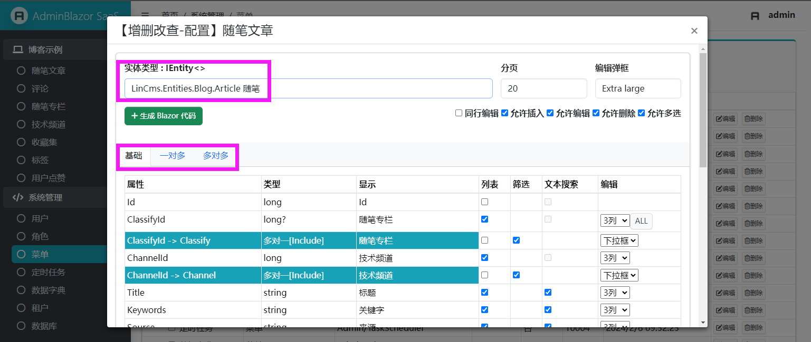

# AdminBlazor

AdminBlazor 是一款 Blazor SSR 后台管理项目，支持 RABC 权限菜单/按钮，支持一对一、一对多、多对多代码生成 .razor 界面。

## 集成功能

- 菜单管理
- 角色管理
- 用户管理
- 定时任务
- 字典管理

## 依赖组件

- BootstrapBlazor
- FreeSql
- FreeScheduler
- Rougamo

# 快速开始

## 1. 安装模板

> dotnet new install AdminBlazor.Template

## 2. 新建项目

> dotnet new admin

## 3. 运行访问

> http://localhost:5231/Admin

用户名：admin 密码：freesql

## 4. 新建菜单，类型选择增删改查


## 5. 生成代码，在实体类型维护注释、导航属性

- 实体上的注释，会生成 HTML Label
- 实体上的导航属性，会生成丰富的 UI
- 创建实体类型，建议继承 Entity/EntityCreated/EntityModifed



# 权限

- UserEntity 对多对 RoleEntity
- RoleEntity 对多对 MenuEntity

提示：AdminLoginInfo 类型已设置成 \[CascadeParameter\]

```csharp
class AdminLoginInfo
{
    public IServiceProvider Service { get; internal set; }
    public UserEntity User { get; set; }
    public List<RoleEntity> Roles { get; private set; }
    public List<MenuEntity> RoleMenus { get; private set; }

    //路由、按钮权限验证
    public Task<bool> AuthPath(string path);
    public Task<bool> AuthButton(string path)
}
```

按钮权限，在 razor 中设置特性：

```csharp
[AdminButton("name")]
void ButtonClick()
{
}
```

之后菜单管理，会出现对应的按钮项，勾选设置角色是否有按钮的权限。


# 组件

== AdminTable2

== AllocTable2

== InputTable2

== SelectEntity

== SelectEnum

== SelectTable2

== AdminModal
