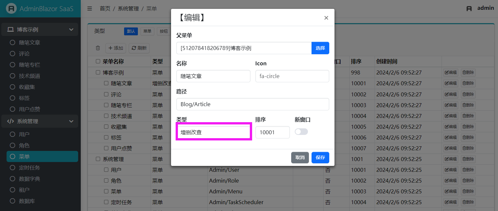

## 项目介绍

AdminBlazor 是一款 Blazor SSR 后台管理项目，支持 RABC 权限菜单/按钮，支持一对一、一对多、多对多代码生成 .razor 界面。

集成功能：菜单管理、角色管理、用户管理、定时任务、字典管理

依赖组件：BootstrapBlazor、FreeSql、FreeScheduler、Rougamo

## 快速开始

1. 安装模板

> dotnet new install AdminBlazor.Template

2. 新建项目

> dotnet new admin

3. 运行访问

> http://localhost:5231/Admin

用户名：admin 密码：freesql

4. 新建菜单，类型选择增删改查



5. 生成代码，在实体类型维护注释、导航属性

- 实体上的注释，会生成 HTML Label
- 实体上的导航属性，会生成丰富的 UI
- 创建实体类型，建议继承 Entity/EntityCreated/EntityModifed


## 权限

- UserEntity 对多对 RoleEntity
- RoleEntity 对多对 MenuEntity

提示：AdminLoginInfo 类型已设置成 \[CascadeParameter\]

```csharp
class AdminLoginInfo
{
    public IServiceProvider Service { get; internal set; }
    public UserEntity User { get; set; }
    public List<RoleEntity> Roles { get; private set; }
    public List<MenuEntity> RoleMenus { get; private set; }

    //路由、按钮权限验证
    public Task<bool> AuthPath(string path);
    public Task<bool> AuthButton(string path)
}
```

按钮权限，在 razor 中设置特性：

```csharp
[AdminButton("name")]
void ButtonClick()
{
}
```

之后菜单管理，会出现对应的按钮项，勾选设置角色是否有按钮的权限。


## 组件

1. AdminTable2\<TItem\>

> 使用 FreeSql 对实体类型 TItem 增删改查

| 名称 | 说明 |
| --- | --- |
| bool IsDebug | 打开UI调试 |
| string Title | 标题，弹框时 |
| int PageSize | 分页，值 -1 时不分开 |
| bool IsQueryString | 查询条件与 URL QueryString 同步 |
| bool IsRemove | 开启删除 |
| bool IsRowRemove | 开启删除（表格每行） |
| bool IsAdd | 开启添加 |
| bool IsEdit | 开启编辑 |
| bool IsRefersh | 开启刷新 |
| bool IsSearchText | 开启文本搜索 |
| bool IsSingleSelect | 开启单选 |
| bool IsMultiSelect | 开启多选 |
| bool IsConfirmEdit | 开启编辑保存时，弹框确认 |
| bool IsConfirmRemove | 开启删除时，弹框确认 |
| int Colspan | 表格一行显示几条记录 |
| int BodyHeight | 表格高度 |
| string DialogClassName | 弹框样式 |
| Func\<AdminQueryInfo, Task\> InitQuery | 初始化查询 |
| EventCallback\<AdminQueryEventArgs\<TItem\>\> OnQuery | 正在查询，设置条件 |
| EventCallback\<TItem\> OnEdit | 正在编辑，设置编辑对象 |
| EventCallback\<List\<TItem\>\> OnRemove | 正在删除 |
| EventCallback\<List\<AdminItem\<TItem\>\>\> OnSelectChanged | 选择内容发生变化 |
| EventCallback\<AdminItem\<TItem\>\> OnRowClick | 单击表格行时 |
| RenderFragment TableHeader | 表格 TR 模板 |
| RenderFragment\<TItem\> TableRow | 表格 TD 模板 |
| RenderFragment\<TItem\> EditTemplate | 添加/编辑 模板 |
| RenderFragment CardHeader | 卡片 Header 模板 |
| RenderFragment CardFooter | 卡片 Fotter 模板 |

2. AllocTable2\<TItem, TChild\>

> 弹框分配实体类型 TItem 【多对多】导航属性

| 名称 | 说明 |
| --- | --- |
| TItem Item | 被分配的对象 |
| string ChildProperty | 被分配的对象的 List&lt;TChild&gt; 属性 |
| string Title | 标题 |
| EventCallback\<TItem\> ItemChanged | 分配变化时 |
| int PageSize | TChild 分页，值 -1 时不分页 |
| bool IsSearchText | TChild 开启文本搜索 |
| EventCallback\<AdminQueryEventArgs\<TChild\>\> OnQuery | TChild 正在查询，设置条件 |
| RenderFragment TableHeader | TChild 表格 TR 模板 |
| RenderFragment\<TItem\> TableRow | TChild 表格 TD 模板 |

== InputTable2\<TItem, TKey\>

> 文本框 + 按钮，弹框绑定 【多对一】、【多对多】导航属性

| 名称 | 说明 |
| --- | --- |
| TKey Value | 值 |
| EventCallback\<TKey\> OnValueChanged | 值变化时 |
| TItem Item | 【多对一】导航属性 |
| EventCallback\<TItem\> OnItemChanged | 【多对一】导航属性变化时 |
| TItem Items | 【多对多】导航属性 |
| EventCallback\<TItem\> OnItemsChanged | 【多对多】导航属性变化时 |
| Func\<TItem, string\> DisplayText | 文本框显示内容 |
| string ModalTitle | 弹框标题 |
| int PageSize | 弹框 分页，值 -1 时不分页 |
| bool IsSearchText | 弹框 开启文本搜索 |
| RenderFragment TableHeader | 弹框 表格 TR 模板 |
| RenderFragment\<TItem\> TableRow | 弹框 表格 TD 模板 |

3. SelectTable2\<TItem, TKey\>

> > 单选、多选绑定，【多对一】、【多对多】导航属性

| 名称 | 说明 |
| --- | --- |
| TKey Value | 值 |
| EventCallback\<TKey\> OnValueChanged | 值变化时 |
| TItem Items | 【多对多】导航属性 |
| EventCallback\<TItem\> OnItemsChanged | 【多对多】导航属性变化时 |
| int PageSize | 分页，值 -1 时不分页 |
| bool IsSearchText | 开启文本搜索 |
| RenderFragment\<TItem\> ChildContent | 内容模板 |

4. AdminModal

> 弹框

| 名称 | 说明 |
| --- | --- |
| string Title | 标题 |
| bool Visible | 是否显示 |
| string DialogClassName | 弹框样式，如：modal-sm、modal-lg、modal-xl、modal-xxl、modal-fullscreen |
| string YesButton | 确认按钮 |
| string CloseButton | 关闭按钮 |
| EventCallback\<TItem\> OnYes | 确认时 |
| EventCallback\<TItem\> OnClose | 关闭时 |
| RenderFragment ChildContent | 内容模板 |